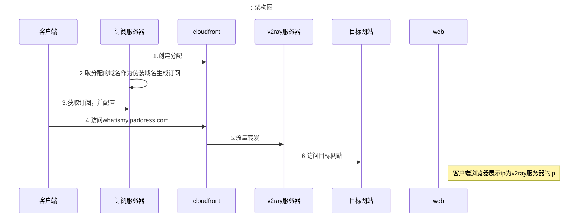

基于一个创建好的v2ray服务器，定时创建cloudfront分配并获取其域名作为伪装地址
可以防止自己的v2ray服务器IP及域名被封

需要有一个nginx等web服务器让用户可以访问到订阅文件

执行时需指定参数
-f 配置文件的完整路径 读取配置文件
-job create/disable/delete 按照配置执行创建订阅/禁用分配/删除分配

大致架构如下：(以访问whatismyipaddress.com为例)

若需在linux系统运行，构建时需执行
    export GOARCH=amd64
    export GOOS=linux
